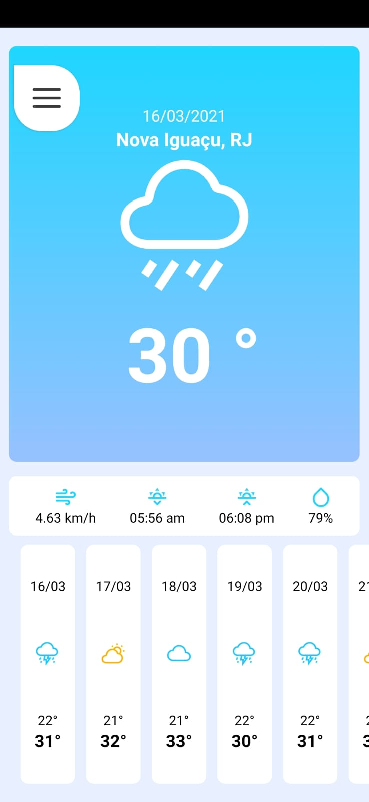
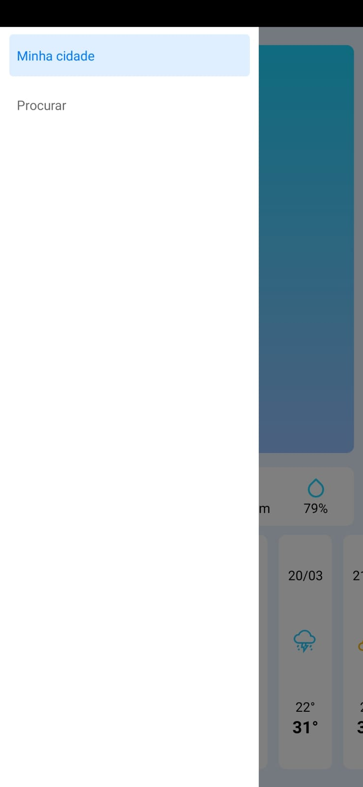
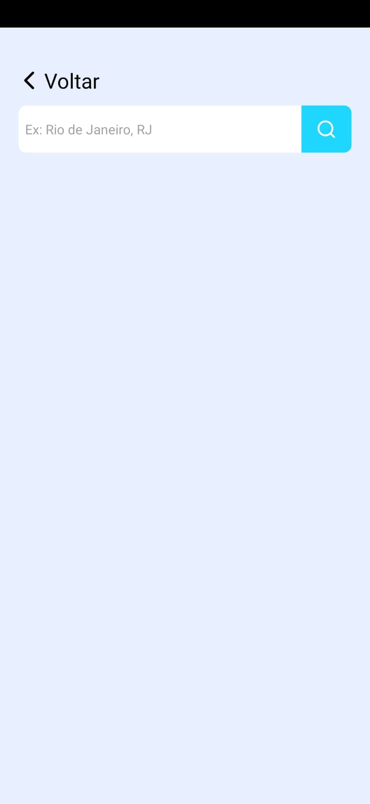
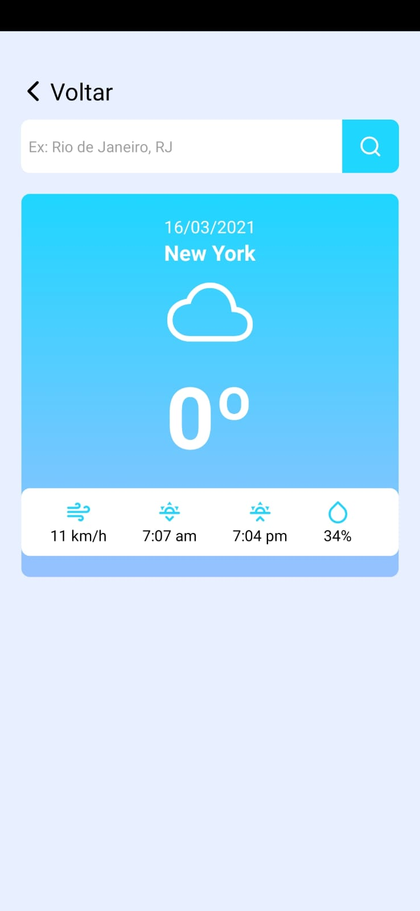
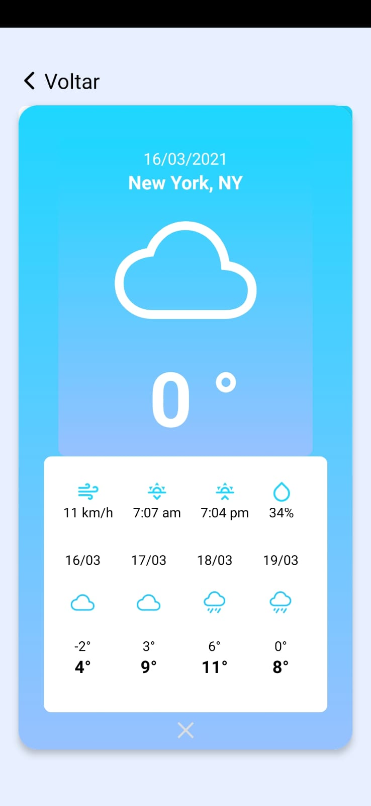

<h1 align="center">
  Tempo
</h1>

  <a href="#-preview">Preview</a>&nbsp;&nbsp;&nbsp;|&nbsp;&nbsp;&nbsp;
  <a href="#-tecnologias">Tecnologias</a>&nbsp;&nbsp;&nbsp;|&nbsp;&nbsp;&nbsp;
  <a href="#-projeto">Projeto</a>&nbsp;&nbsp;&nbsp;|&nbsp;&nbsp;&nbsp;
  <a href="#-como-executar">Como executar</a>&nbsp;&nbsp;&nbsp;|&nbsp;&nbsp;&nbsp;
  <a href="#-licença">Licença</a>

 

 ## 🖼️ Preview
 

 <h3>Home<h3/>
  
  
  

   

   <h3>Search<h3/>
  
 
  
 

 

<h3>Gif<h3/>

 

## ✨ Tecnologias

Esse projeto foi desenvolvido com as seguintes tecnologias:

- [React Native](https://reactnative.dev/)
- [Expo](https://expo.io/)

## 💻 Projeto

O app "Senhor do Tempo" mostra as informações do tempo e a previsão dos próximos 10 dias  para sua localização e também permite que você faça uma pesquisa por cidade.
Este projeto foi criado por [sujeitoprogramador](https://www.instagram.com/sujeitoprogramador/) no seu curso Insider Rect Native 2.0. Utiliza a API da [HG Brasil](https://hgbrasil.com/).

## 🚀 Como executar

- Tenha o [Expo](https://expo.io/) instalado
- Clone o repositório
- Instale as dependências com `yarn`
- Crie uma conta na [HG Brasil](https://hgbrasil.com/)
- Gere na sua conta da HG Brasil uma chave
- No arquivo `src/services/api.js` substitua a variável key  pela chave gerada.
- Inicie o servidor com `yarn start`

Agora você pode acessar pelo seu aparelho utilizando o aplicativo da Expo ou tendo um emulador na sua maquina.

## 📄 Licença

Esse projeto está sob a licença MIT. Veja o arquivo [LICENSE](LICENSE.md) para mais detalhes.

---
